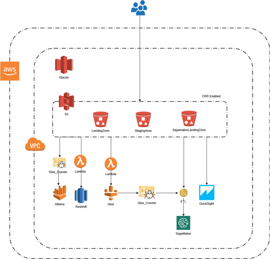

# Forest Wildfire Analytics w/ AWS Cloud
Wildfires can cause devastating destruction and cost millions of dollars in damage, especially with increasing human development near wilderness or rural areas. The ability to predict wildfires would be a preemptive measure to prevent and/or manage wildfires. Factors affecting wildfires would be explored and used to gauge the probability of a wildfire occurring. Based on the location and the corresponding land type, a machine learning model will be trained to identify the major contributing factors of the fire. For this project, we will be utilizing AWS Cloud to design a **machine learning workflow** that is flexible, robust, and automated.

## Architecture

## Technologies used
- Python + Libraries
  - numpy, sklearn, scipy, matplotlib, Flask, boto3
- Jupyter Notebook
- AWS S3
- AWS Glue
- QuickSight
- AWS SageMaker
- AWS CloudWatch Logs

## Feature List:
- FIRE_YEAR  (long)
- STAT_CAUSE_DESCR (string)
- FIRE_SIZE (double)
- FIRE_SIZE_CLASS (string)
- LATITUDE  (double)
- LONGITUDE (double)
- STATE (string)
- COUNTY (long)
- DISCOVERY_DATE (double)
- CNT_DATE (double)

## How to use
- Local Configuration
  - Python/Jupyter notebook (numpy, sklearn, scipy, matplotlib, Flask, boto3)
  - Download the source data file
  - Script to convert the data file into a csv format
- How to set up and kick-off project from developer sandbox?
  - Import python code for source file conversion
  - Run the job on any Python IDE to generate a target csv file
  - Create a S3 bucket and push the csv file into it
  - Access the AWS account
  - With SageMaker, train and deploy model
- Here include quick steps on how to compile and run your project on local machine (whichever you used, Mac or Windows either one).
  - Run the source file conversion job on Jupyter Notebook/Spyder
  - Use the file generated as the source for model
  - Import and run the model training code on Jupyter Notebook/Spyder
